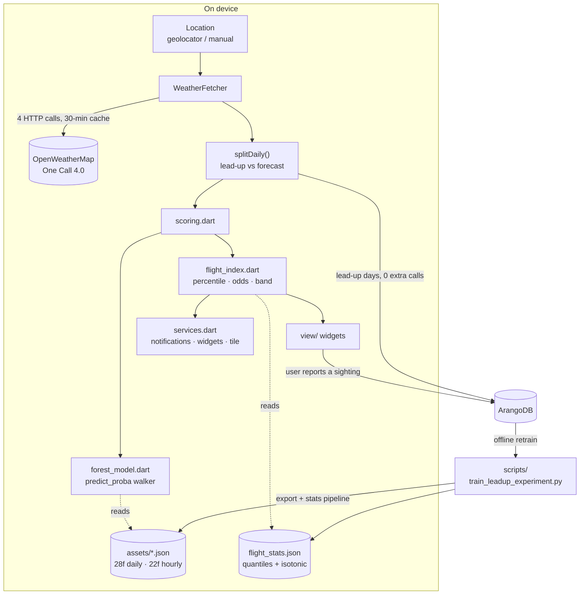

# Architecture — Ant Nuptial Flight Predictor

How the app is put together, why it is put together that way, and which
seams break if you move them. For commands, release process and house rules
see [AGENTS.md](../AGENTS.md); this file is the *shape* of the system.

Per-folder notes live in `AGENTS.md` inside each source folder. Start there
when you already know which folder you are working in.

---

## 1. What the system actually is

A Flutter app (Android / iOS / Web, plus unshipped desktop targets) that
answers one question — *will queen ants fly today?* — and a crowd-sourcing
loop that makes the answer better over time.

Three things make it more than a weather skin:

1. **Two RandomForest models run on-device.** No inference server. The
   forests ship as JSON assets and are walked in pure Dart.
2. **Raw model output is not shown to anyone.** A calibration layer turns an
   uncalibrated tree-vote fraction into a percentile and honest "1 in N"
   odds. This layer is where most UI bugs actually originate.
3. **Users' sighting reports become the next model's training data.** The
   app both consumes and produces the dataset.

---

## 2. End-to-end flow

The loop closes: reports go to ArangoDB, an offline retrain turns them into
new forest JSON and a new stats table, and those ship as assets in the next
release. Nothing is fetched from a model server at runtime.

---

## 3. The four layers

### Layer 1 — Data acquisition (`lib/controller/weather_fetcher.dart`)

Four HTTP calls per cold foreground load; only the two One Call 4.0 timeline
requests are billed. The full budget table is in AGENTS.md and **must be
updated if you add a call to a hot path**.

The load-bearing piece is `splitDaily`. One paid daily request is anchored
two local days in the past with `cnt = leadUpDays + 8`, so a single call
returns both the antecedent weather and the 8-day forecast. It splits at the
**location-local** day boundary, which is why `daily[0]` is reliably local
today rather than UTC today. It is pure and unit-tested — keep it that way;
it is the cheapest place in the app to be wrong about time zones.

### Layer 2 — Scoring (`lib/controller/scoring.dart`, `nuptials.dart`, `models/`)

`scoring.dart` is deliberately boring: length-safe iteration that calls the
forest **at most once per slot** and zero-fills short pages instead of
throwing (the 4.0 endpoints page, so lists arrive shorter than the UI's fixed
slot counts).

`nuptials.dart` builds the feature vectors. This is the contract surface —
see §4.

`models/forest_model.dart` is ~80 lines that walk the sklite-format JSON and
reproduce sklearn's `predict_proba` (mean of per-tree normalised leaf values,
inputs cast to float32). Parity with Python is ~1e-14, pinned by
`test/production_model_parity_test.dart`.

### Layer 3 — Interpretation (`lib/controller/flight_index.dart`)

**This layer is the most common source of "the UI looks wrong" bugs, and the
least obvious.** A raw score is an uncalibrated fraction of trees voting
"flight". On its own it means nothing to a user. `flight_stats.json` turns it
into two things people can act on:

- a **percentile** against ~219k historical days at the same hemisphere and
  calendar month, and
- a **calibrated probability** (offline isotonic fit) → the "1 in N" line.

`bandFor()` then maps calibrated probability onto five bands as multiples of
the all-days base rate:

| Band | Rule | Roughly (2026-08 stats) |
|---|---|---|
| `noFly` | score ≤ 0.011 (hard weather cutoff) | cold / gale |
| `quiet` | p < 1× base rate | ~53–79% of all days |
| `watchful` ("Fair") | p ≥ 1× base | |
| `promising` | p ≥ 2× base | ~1-in-11 or better |
| `prime` | p ≥ 4× base | ~1-in-5 or better |

**The quiet band is the majority of days by design.** That is the honest
answer, and it caused a real regression: a chart that painted `quiet` the
same grey as `noFly` rendered as one flat grey block ~70% of the time. If a
visual encoding collapses on quiet days, it is broken — test it with a quiet
day, not a prime one.

### Layer 4 — Presentation and surfaces

`lib/view/` renders it; `services.dart` pushes the same band to background
surfaces (notifications, home-screen widgets, the Android quick-settings
tile). All of them derive from `bandFor()`/`bandLabel()`, so band changes
propagate automatically — which also means a band-threshold change silently
changes when users get notified.

---

## 4. The model contract (the thing that breaks silently)

Both forests take features in a **fixed positional order**. Nothing validates
it at runtime — a wrong order produces plausible-looking numbers, not a
crash.

| | Base features | + lead-up | Total |
|---|---|---|---|
| Daily (`final_model.json`) | 21 | 7 | **28** |
| Hourly (`hour_model.json`) | 15 | 7 | **22** |

The 7 shared lead-up features (`lib/controller/leadup_features.dart`):
`prev1_rain, prev2_rain, dpress1, dtemp1, days_since_rain,
warm_dry_after_rain, has_prev1`.

Four places must move together, or none of them:

1. `nuptialDailyPercentageModel` / `nuptialHourlyPercentageModel`
   (`lib/controller/nuptials.dart`)
2. `scripts/train_leadup_experiment.py` (`DAILY_BASE` / `HOURLY_BASE` / `add_leadup`)
3. the PD-gauge feature indices used by `why_panel.dart`
4. `test/model_test.dart`, `nuptials_test.dart`, `production_model_parity_test.dart`

Never hand-edit `assets/*_model.json` — regenerate via
`scripts/export_leadup_models.py`.

### The daily/hourly asymmetry — read before touching `minBand`

The hourly bars are capped at the day's band. It is tempting to read that as
"the daily model is the authoritative one". **It is not.** Under the honest
evaluation protocol (grouped CV by install + dedup + temporal holdout) the
hourly model is the *better* of the two:

| Model | AUC (CV) | AUC (holdout) | AP (CV) | AP (holdout) |
|---|---|---|---|---|
| daily 28f | 0.660 | 0.639 | 0.147 | 0.097 |
| **hourly 22f** | **0.671** | **0.666** | **0.149** | **0.102** |

The cap earns its place for two different reasons:

1. **The hourly model has no rain or cloud feature at all.** It cannot see
   that it is pouring. The daily model carries `pop`, `cloud`, `rainMm` and
   `popNext1/2`. Capping stops a downpour reading as a promising afternoon.
2. **`flight_stats.json` contains only a daily-fitted calibration and
   quantile table**, but `bandFor()` is applied to hourly scores too. A daily
   0.55 and an hourly 0.55 do not mean the same thing, and nothing
   distinguishes them.

Reason 2 is a genuine soundness gap, tracked as bead `nf-k0o`. Fixing it —
fitting hourly quantiles/isotonic alongside the daily ones — is the
prerequisite for revisiting the cap. Do not remove the cap before then.

---

## 5. The data loop

`lib/controller/arangodb.dart` writes to ArangoDB. Legacy `flights` /
`historical` / `current` schemas are **frozen** (see
[database_schema.md](database_schema.md)); the newer `leadup` collection
captures antecedent weather.

Two properties worth knowing:

- Lead-up features are derived **uniformly for positives and negatives** in
  training via a self-join. The positives-only `leadup` collection is used
  only to *validate* that derivation, not as the training source — otherwise
  the feature would leak the label.
- Evaluation uses GroupKFold by install + per-(install, location, day) dedup.
  Random splits inflate every metric here, because one user reporting one
  flight generates many near-duplicate rows. The 0.654/0.670 AUCs in older
  notes are inflated; 0.660/0.671 are the honest numbers.

---

## 6. Cross-cutting invariants

| Invariant | Enforced by | Breaks as |
|---|---|---|
| Feature order matches training | nothing at runtime | plausible wrong numbers |
| Every user-visible string is an ARB key in 13 locales | `flutter gen-l10n` | missing/English text |
| No paid OWM call on a hot path without a budget update | review only | silent bill increase |
| Never log a URL containing `appid=` | `redactUrl()` in `lib/utils.dart` | live key in release device logs |
| App Store text mentions no third-party platform | `ios_description()` guard in `gen_listings.py` | Guideline 2.3.10 rejection |
| First frame stays non-blocking | review only | slow cold start |
| Colour is never the only encoding | review + widget tests | inaccessible UI |

---

## 7. Where to start, by task

| Task | Start at |
|---|---|
| Forecast number looks wrong | `flight_index.dart` (calibration) before `nuptials.dart` (model) |
| Chart/pill colour looks wrong | `view/verdict.dart` — `bandColors()` is the single source |
| Missing/short forecast data | `weather_fetcher.dart` `splitDaily` + `scoring.dart` zero-fill |
| Adding a model feature | §4 — all four places, one change |
| New user-visible copy | `lib/l10n/app_en.arb`, then `flutter gen-l10n` |
| Store listing text | `scripts/store/gen_listings.py`, never the generated files |
| Background/notification behaviour | `controller/services.dart` |
